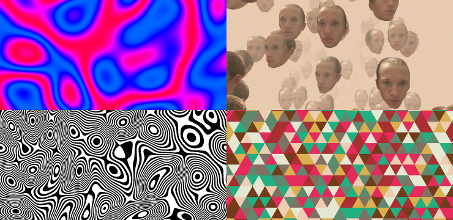

# WebGL Demos

Mostly simple things done with Three.js.

## Usage

Clone this repo. Build and run it by typing:

    npm run up

Go to [localhost:3000](http://localhost:3000) to see it. See other [supported
commands][sc].

## License

MIT

[sc]: https://github.com/paul-nechifor/intercessor#supported-commands
